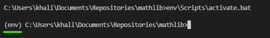
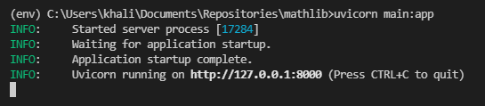

# mathlib
Math library API for FastAPI tutorial. 
## Getting Started
1. Create a virtual environment if you haven't created one
```
python3 -m venv env
```

2. (Unix) Activate the environment
```
source env/bin/activate
```
2. (Windows) Activate the environment
```
env\Scripts\activate.bat
```

You should see "(env)" in front of each line to know if the virtual environment is active:  


3. Install the requirements
```
pip install requirements.txt
```

4. Run the server using uvicorn
```
uvicorn main:app
```
You should see something like this in your command line:  

